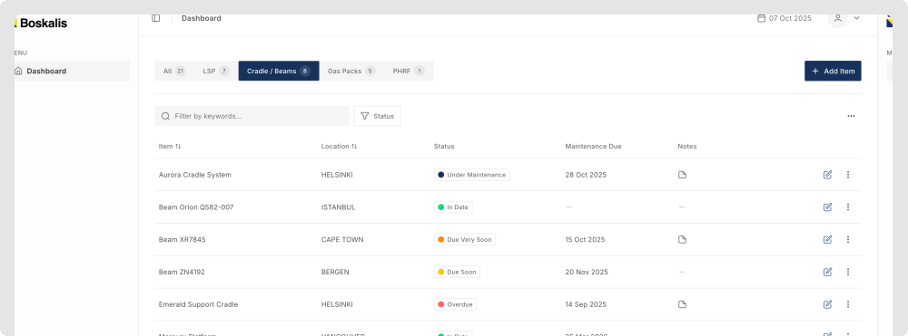
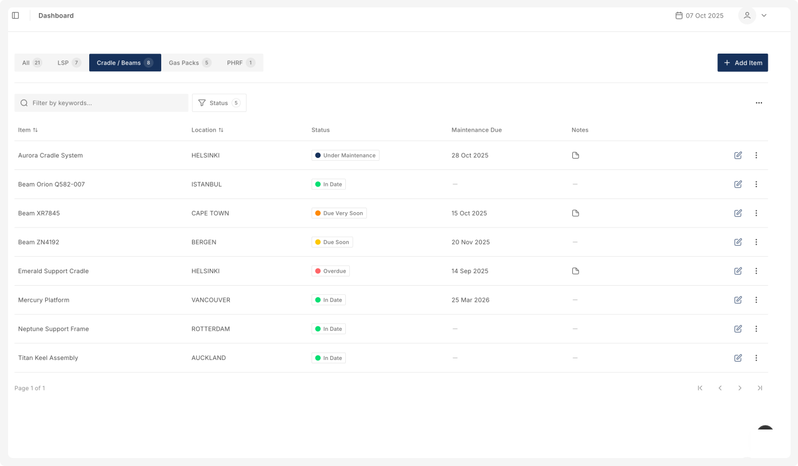

# Boskalis Maintenance System

A custom-built maintenance management system for maritime equipment tracking and maintenance scheduling.

**Client:** Boskalis  
**Status:** In Production

## Features

- Maintenance status tracking with automated status calculations
- Create, update and delete maintenance records
- Mark items as under maintenance
- Archive system for inactive or decommissioned equipment
- Track equipment details, maintenance types and schedules
- Add notes to records
- Filter by status (Overdue, Due Soon, etc.)
- Multi-term search across all fields
- Sort by due date, name or status
- Persisted filter state using cookies (equipment type & status filters)
- CSV export for reporting
- User authentication (email/password)
- Responsive design for desktop and mobile

## Architecture
* **Dynamic status calculation** - Status calculated using `date-fns` based on client business logic and synced to database
* **Multi-layer caching** - Server-side caching with Next.js `unstable_cache` and client-side SWR with automatic revalidation
* **Server actions** - Secure database operations with Next.js server actions and Prisma, validated with Zod on both client and server
* **Cookie-based persistence** - User filter preferences (equipment type & status filters) saved across sessions
* **Error handling** - Automatic rollback on failed mutations with toast notifications

## Tech Stack

- Next.js (React 19)
- TypeScript
- Tailwind
- shadcn/ui
- Prisma (PostgreSQL)
- Better Auth
- Tanstack Query
- React Hook Form
- Zod
- date-fns
- TanStack Table

  
