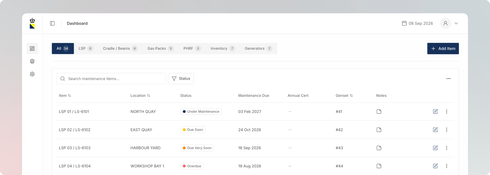
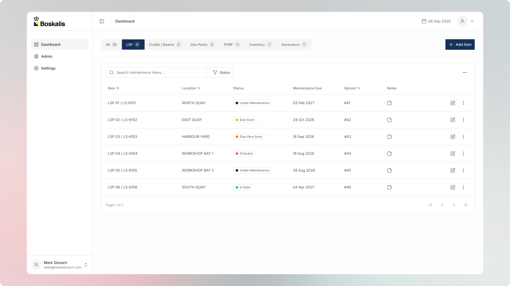

# Boskalis Maintenance System
A production maintenance management application built for Boskalis to bring maritime equipment records, maintenance schedules and user access into one clear system.

> This repository showcases the application using mock data. Production source code and operational data are not included.

## The Problem
The project began with a photograph of the whiteboard the team used to track equipment, alongside an Excel spreadsheet. I turned that workflow into a single system that is now used in production and continues to evolve with the team’s requirements.

## Demo

## Features
### Equipment Management
* Tracks equipment details, locations, gensets, notes and maintenance or certification dates
* Calculates and displays status using client-specific due-date rules, including an under-maintenance override
* Organises records by equipment type with fuzzy search, status filtering, sorting and pagination
* Allows authorised users to create, edit, archive and restore records, with permanent deletion restricted to admins
* Saves filter preferences and exports the maintenance register to CSV

### Users and Access
* Provides email-and-password authentication with protected application routes
* Enforces viewer, editor and admin permissions in both the interface and server operations
* Gives administrators tools to create, edit and remove users, assign access and review verification status
* Provides email onboarding, password setup and account session controls

## Architecture
* **Maintenance status** — The same calculation is used throughout the application, based on due dates and whether an item is archived or under maintenance.
* **Permissions** — Every Server Action checks the signed-in user and their role before making changes, and form data is validated with Zod.
* **Data and tables** — TanStack Query handles cached data and refreshes, while TanStack Table handles searching, filtering, sorting and pagination.
* **User onboarding** — Better Auth handles user accounts, while password-setup emails are built with React Email and sent through Resend.
* **Monitoring** — Client and server errors are captured using Sentry-compatible monitoring.

## Tech Stack
* **Application:** Next.js 16, React 19, TypeScript, Tailwind CSS 4, shadcn/ui and Radix UI
* **Data and authentication:** PostgreSQL, Prisma 7, Better Auth, TanStack Query 5 and TanStack Table 9
* **Forms and services:** React Hook Form, Zod, Resend, React Email and Sentry

## Screenshots
